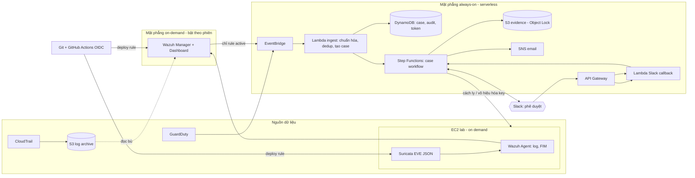

# SIEM/SOAR trên AWS: Wazuh + GuardDuty + Suricata với quy tắc phát hiện quản lý bằng mã

Đồ án chuyên ngành (UIT – Khoa Mạng máy tính và Truyền thông) · Nguyễn Đoàn Hồng Huy · 23520628 · NT114.R11

Hệ thống SIEM/SOAR quy mô lab trên **một tài khoản AWS**: gom cảnh báo **cloud** (GuardDuty/CloudTrail), **host**
(Wazuh Agent: log, FIM, xác thực) và **network** (Suricata IDS) vào **một lớp case thống nhất**, tự động hóa quy trình
xử lý **luôn có người phê duyệt** (Slack, dự phòng SNS email + CLI), có cách ly – xác minh – khôi phục – audit, và
**rule được quản lý như code** (Git → PR → test tự động → shadow → active → rollback).

> Bản mô tả đầy đủ (Việt) ở [`docs/`](docs/). Đề cương gốc là nguồn yêu cầu; những chỗ code cụ thể hóa hoặc đi chệch
> khỏi đề cương được ghi ở mục [Ánh xạ đề cương ↔ code](#ánh-xạ-đề-cương--code).

## Kiến trúc



Chi tiết: [docs/architecture.md](docs/architecture.md).

## Những gì có trong repo

| Thư mục | Nội dung |
|---|---|
| `infra/bootstrap` | State bucket + OIDC GitHub↔AWS với 3 role (plan chỉ đọc, apply theo Environment, rules least-privilege) |
| `infra/modules/serverless-core` | Mặt phẳng always-on: DynamoDB, S3 (evidence Object Lock, CloudTrail, rules), GuardDuty, CloudTrail, EventBridge+DLQ, 10 Lambda (role riêng, least privilege), Step Functions, API Gateway, SSM params, alarm, Budgets, timer tự tắt |
| `infra/modules/lab-ondemand` | Mặt phẳng on-demand: VPC không cổng vào, Wazuh all-in-one, EC2 lab (Wazuh Agent + Suricata), IMDSv2, SSM document deploy rule, IAM victim user |
| `src/lambdas/siemsoar` | Thư viện lõi: schema chuẩn hóa, store DynamoDB (state machine case, dedup nguyên tử, token một lần, circuit breaker), Slack, evidence, response (EC2/IAM) |
| `src/lambdas/handlers` | Lambda handler: `ingest`, `enrich`, `notify`, `slack_interact`, `preflight`, `save_state`, `contain`, `restore`, `case_ops`, `lab_session` |
| `statemachine/` | Case workflow (sinh bởi `tools/gen_asl.py`, có `--check` trong CI) |
| `rules/` | Wazuh XML, Suricata rules, **metadata YAML** (state, MITRE, FP kỳ vọng, test dương/âm) |
| `tools/` | `rulesctl` (lint/test/lifecycle/build/promote/coverage/tune), `rule_engine`, `suricata_pcap_test`, `make_pcaps`, `release`, `soarctl`, `export_evidence`, `gen_asl` |
| `wazuh/`, `suricata/`, `scripts/` | Bootstrap manager/agent/sensor, integration `custom-eventbridge`, `deploy_rules.sh` (kiểm tra + tự rollback trên host) |
| `simulation/` | 14 kịch bản có ground truth (host, AWS, network, robustness) + runner; kịch bản vòng đời rule chạy qua pipeline CI/CD (xem `docs/detection-as-code.md`) |
| `evaluation/` | Tính toàn bộ chỉ số của đề cương từ dữ liệu thật + baseline + chi phí |
| `tests/` | 120+ test (moto): unit, workflow end-to-end chạy **đúng ASL thật** với handler thật |
| `.github/` | CI, Terraform plan/apply, `rules-deploy`, `lab-session`, PR template |

## Bắt đầu nhanh

```bash
make install && make all          # lint + ASL + test + rules + terraform validate
```

Triển khai thật (chi tiết từng bước, kể cả tạo Slack App: [docs/runbook.md](docs/runbook.md)):

1. `infra/bootstrap` → `terraform apply -var github_repo=<user>/SIEM-SOAR-LAB` (chạy local một lần).
2. Tạo GitHub **variables**: `TFSTATE_BUCKET, PLAN_ROLE_ARN, APPLY_ROLE_ARN, RULES_ROLE_ARN, ALERT_EMAIL`, và **environments** `lab`, `lab-rules` (bật required reviewers).
3. Merge → workflow `terraform` apply. Mặc định `dry_run=true`: workflow chạy trọn vẹn nhưng chưa thay đổi EC2/IAM.
4. Đặt secret Slack vào SSM (không qua Terraform state), xác nhận email SNS.
5. Actions → **lab-session** → `up` (bật Wazuh + EC2 lab, tự tắt sau N giờ).
6. `python -m simulation.runner run host-marker` rồi `python -m evaluation.evaluate`.

## Trạng thái kiểm chứng (trung thực)

| Hạng mục | Đã kiểm chứng bằng | Chưa kiểm chứng |
|---|---|---|
| Logic case, dedup, token một lần, double-click, breaker, fail-safe, restore, IAM key rotation | 120+ test với moto, workflow chạy đúng ASL + handler thật | Hành vi AWS thật (moto không mô phỏng hết ràng buộc IAM/SG) |
| Rule Suricata | `suricata -T` + replay pcap bằng **Suricata thật** (3 TP, benign = 0 alert) | Hiệu năng/độ nhiễu trên traffic thật |
| Rule Wazuh | Mini-engine offline (cú pháp rule dùng trong repo) | `wazuh-analysisd -t` / `wazuh-logtest` trên Wazuh thật (script có sẵn trong `deploy_rules.sh`) |
| Terraform | `fmt`, `validate`, `terraform test` (plan đầy đủ với provider mock, có/không có mặt phẳng lab) | `plan/apply` trên tài khoản thật |
| Bootstrap Wazuh/Suricata | `bash -n` + shellcheck | Chạy thật trên Ubuntu 22.04 (cần tinh chỉnh theo phiên bản Wazuh) |

Nghĩa là: **phần phần mềm/logic đã được test kỹ; phần chạm hạ tầng thật cần chạy phiên đầu tiên với `dry_run=true`**
và theo checklist trong runbook.

## Ánh xạ đề cương ↔ code

| Đề cương | Hiện thực |
|---|---|
| 4.1 Hai mặt phẳng | `serverless-core` (always-on) / `lab-ondemand` (+ `lab_session`, timer tự tắt, Budgets) |
| 4.2 Bảng thành phần | Wazuh/Agent (`wazuh/`, `suricata/`), GuardDuty/CloudTrail (`guardduty.tf`, `cloudtrail.tf`), EventBridge, Step Functions, DynamoDB, Slack+SNS, GitHub Actions |
| 4.3 Hình 2 – vòng đời rule | `rulesctl lint/test/lifecycle/build/promote`, `rules-deploy.yml`, `release rollback` |
| 4.3 Hình 3 – luồng phát hiện→phản ứng | `statemachine/case_workflow.asl.json` |
| 4.3 Hình 4 – trạng thái case | `siemsoar/states.py` (+ `ACKNOWLEDGED` cho case không có hành động phản ứng) |
| 4.3 Hình 5 – vùng security/workload/simulation | tag `siemsoar:zone`, IAM điều kiện theo tag, tiền tố `lab-` cho IAM user |
| 4.4 Nguyên tắc | managed first, everything as code, human approval, fail-safe, cost awareness (xem `docs/architecture.md`) |
| 5.2 nhóm 1–8 | bootstrap OIDC; Wazuh/agent; CloudTrail→S3 + GuardDuty→EventBridge; rule as code; case workflow/Slack/task token; response/restore; simulation/ground truth; vận hành/teardown (`export_evidence`) |
| 5.4 Kịch bản | `simulation/scenarios/*.yml` |
| 6.2 Chỉ số | `evaluation/evaluate.py` |
| 6.3 Baseline | `evaluation/baseline.example.csv` + `evaluate` so sánh |
| 6.5 Giới hạn | [docs/limitations.md](docs/limitations.md) |

**Điểm khác/bổ sung so với đề cương** (có chủ đích): (1) Wazuh đẩy alert *active* lên EventBridge bằng integration tự
viết `custom-eventbridge` (không qua webhook công khai); (2) thêm trạng thái `ACKNOWLEDGED`; (3) cổng phê duyệt **thứ hai**
cho bước restore (hình 3: "thực sự mối đe dọa?" → restore TP/FP); (4) rotate key bằng Secrets Manager khi xác nhận bị lộ;
(5) circuit breaker + `dry_run` + fault-injection để chứng minh robustness; (6) kênh quyết định dự phòng `soarctl`
(dùng thông tin xác thực AWS, không thể giả mạo qua email).
