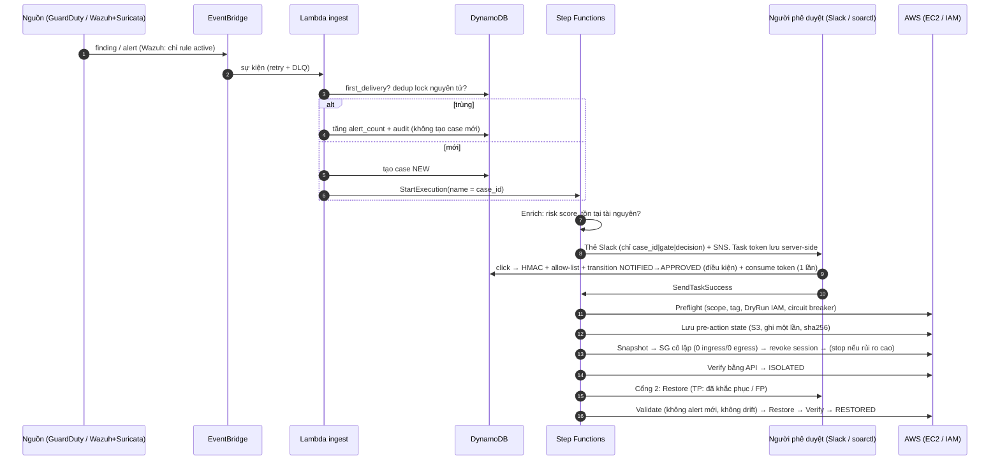
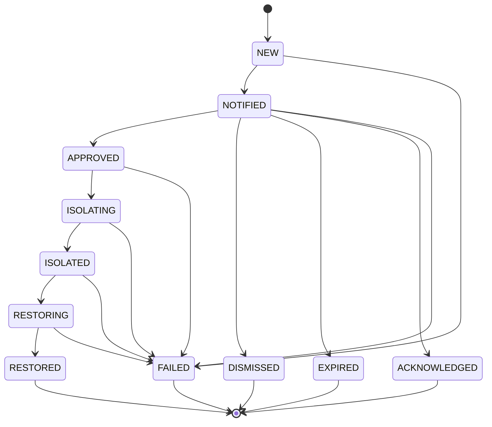

# Kiến trúc chi tiết

## 1. Hai mặt phẳng

| | Always-on (serverless) | On-demand (bật theo phiên) |
|---|---|---|
| Thành phần | CloudTrail→S3, GuardDuty, EventBridge(+DLQ), Lambda, Step Functions, DynamoDB, S3 evidence, SNS, API Gateway | VPC lab, Wazuh Manager+Indexer+Dashboard, EC2 lab (Wazuh Agent + Suricata) |
| Chi phí | Trả theo dùng (~vài USD/tháng khi nhàn rỗi; GuardDuty tính theo khối lượng) | Chỉ tính khi bật; `tools.labctl` bật lab và đặt timer tự tắt: EventBridge Scheduler gọi thẳng `ec2:StopInstances` (không Lambda) |
| Khi tắt | Cloud path (GuardDuty) vẫn tạo case | Telemetry host/Suricata có khoảng trống; CloudTrail trong S3 được Wazuh đọc bù khi bật lại |
| Terraform | `infra/modules/serverless-core` | `infra/modules/lab-ondemand` (`count = lab_enabled ? 1 : 0`) |

## 2. Luồng dữ liệu

## 3. Trạng thái case

Mọi chuyển trạng thái là một `UpdateItem` **có điều kiện** (`status IN (...)`) nên double-click, retry của Lambda hay
hai kênh quyết định (Slack + CLI) đồng thời chỉ có một kết quả hợp lệ. Mỗi chuyển trạng thái ghi một dòng audit bất biến.

## 4. Mô hình dữ liệu (DynamoDB một bảng)

| pk | sk | Nội dung |
|---|---|---|
| `CASE#<id>` | `META` | case: nguồn, rule, tài nguyên, severity, risk, plan, thời điểm từng bước, `containment_seconds`, `evidence_seconds`, `verdict` |
| `CASE#<id>` | `AUDIT#<ts>#<n>` | audit (ai, làm gì, khi nào, chi tiết) – chỉ ghi thêm |
| `CASE#<id>` | `TOKEN#approval|restore` | task token Step Functions, `used`, TTL (không bao giờ gửi cho Slack) |
| `DEDUP#<key>` | `LOCK` | khóa cửa sổ dedup → `case_id` |
| `ALERT#<id>` | `SEEN` | idempotency cho EventBridge at-least-once |
| `BREAKER#isolation` | `BUCKET#<n>` | tập case_id trong cửa sổ (đếm idempotent) |
| `FEEDBACK#<rule>` | `<ts>#<case>` | phản hồi FP để tuning rule |
| `RUN#<id>` | `META` | lượt mô phỏng + ground truth + kết quả |

GSI: `dedup-index`, `resource-index (resource_id, created_at)`, `status-index (status, created_at)`.

## 5. Mô hình bảo mật

* **Không có cổng vào**: VPC lab không có inbound; quản trị bằng SSM Session Manager; dashboard qua port-forward.
* **OIDC, không khóa dài hạn**: role `plan` (ReadOnly, chỉ `pull_request`), `apply` (chỉ job gắn Environment `lab`, cần reviewer duyệt), `rules` (chỉ upload S3 + SSM SendCommand tới instance gắn tag `ondemand`).
* **SOAR không thể vượt phạm vi**: IAM của Lambda giới hạn thao tác ghi EC2 trên instance có tag `siemsoar:zone=workload`, IAM user có tiền tố `lab-`, role `siemsoar-lab-*`; Wazuh manager gắn `siemsoar:protected=true`.
* **Slack**: HMAC (cửa sổ 5 phút), allow-list người duyệt trong SSM, token ở server, nút chỉ mang `case_id|gate|decision`.
* **Secret**: SSM SecureString (đặt ngoài Terraform), key xoay vòng ghi vào Secrets Manager, không bao giờ vào state/log/DynamoDB (có test).
* **Evidence**: S3 Versioning + Object Lock (GOVERNANCE) + SSE + TLS-only; ghi một lần, hash trong case, kiểm lại hash trước restore.
* **Log Step Functions** không chứa payload (`include_execution_data=false`).

## 6. Nguyên tắc thiết kế → hiện thực

| Nguyên tắc | Hiện thực |
|---|---|
| Managed first | Dịch vụ AWS quản lý; thao tác một lệnh API (`ec2:StopInstances`, `iam:UpdateAccessKey`, ghi audit DynamoDB) chạy bằng **SDK integration** của Step Functions với Retry/Catch gốc; chỉ phần có logic (preflight, cô lập SG, restore, xác minh) mới là Lambda (boto3 + stdlib) |
| Everything as code | Terraform, rule + metadata, workflow (sinh bằng `gen_asl`), pipeline |
| Human approval | 2 cổng (containment, restore); hết hạn → `EXPIRED`, không làm gì |
| Fail safe | Lỗi giữa chừng → giữ trạng thái an toàn đã đạt (không tự rollback), `FAILED` + SNS/Slack + alarm CloudWatch |
| Cost awareness | `labctl` + timer Scheduler, Budgets, PAY_PER_REQUEST, log 14 ngày, không NAT |
