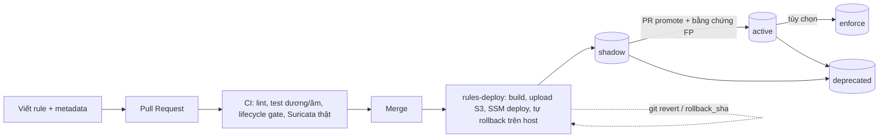

# Detection-as-Code

## Vòng đời rule (Hình 2 của đề cương)

| Trạng thái | Ý nghĩa | Wazuh | Suricata |
|---|---|---|---|
| `shadow` | Ghi nhận alert, **không** tạo case | rule được gắn group `siemsoar_shadow`; integration chỉ forward `siemsoar_active/enforce` | vẫn `alert` (EVE JSON), rule ánh xạ Wazuh mang state |
| `active` | Alert thành case và vào SOAR | `siemsoar_active` → EventBridge | như trên |
| `enforce` (tùy chọn) | Minh họa chặn trên host | như active | build đổi `alert`→`drop` khi `--allow-drop` (chỉ khi Suricata chạy inline) |
| `deprecated` | Gỡ khỏi bản build | bị loại | bị loại |

Các group `siemsoar_<state>` và `resp_<response>` **không viết tay**: `rulesctl build` chèn từ metadata (lint chặn việc viết tay),
nên trạng thái rule chỉ đổi được bằng một dòng `state:` trong PR.

## Thêm một rule
1. Wazuh: thêm `<rule id="1001xx">` vào `rules/wazuh/*.xml` (dải 100000–119999). Suricata: thêm dòng `alert ... sid:90000xx` vào `rules/suricata/siemsoar.rules`, msg bắt đầu bằng `SIEMSOAR`.
2. Tạo `rules/metadata/<engine>-<id>.yml` (xem mẫu): `state: shadow`, `response`, `mitre`, `expected_fp`, `tests` (≥1 `match`, ≥1 `no_match`). Rule Suricata thêm `level` (dùng cho rule ánh xạ Wazuh `110000 + sid − 9000000`) và `pcap`.
3. `python -m tools.rulesctl lint && python -m tools.rulesctl test` (+ `python -m tools.suricata_pcap_test`).
4. Thêm kịch bản `simulation/scenarios/*.yml` (có test bắt buộc mọi rule phải có kịch bản và kỳ vọng khớp với state của rule).

## Các lớp kiểm thử
| Lớp | Công cụ | Bắt được gì | Giới hạn |
|---|---|---|---|
| Cú pháp/metadata | `rulesctl lint` | thiếu metadata, id sai dải, MITRE sai/không khớp XML, group lifecycle viết tay | – |
| Mẫu sự kiện dương/âm (nhanh, offline) | `rulesctl test` (mini-engine `tools/rule_engine.py`; chỉ là bộ lọc sơ bộ, **không** thay engine thật) | anchor sai, field sai, match quá rộng, frequency/timeframe/same_source_ip | Không phải Wazuh thật; `frequency` tính ≥ N |
| Suricata thật | `tools.suricata_pcap_test` | cú pháp (`-T`), TP trên pcap, **benign không alert** | pcap tổng hợp, không phải traffic thật |
| Wazuh thật (CI) | job `wazuh-engine`: image `wazuh/wazuh-manager` + `wazuh-analysisd -t` + `tools.wazuh_logtest` (API `PUT /logtest`) | decoder → rule cha → rule tùy chỉnh → `frequency/timeframe` **đúng engine production**; mẫu log thô `log:`/`logs:` trong metadata | cần mẫu log thô cho từng rule (`--strict` bắt rule active chưa có mẫu) |
| Wazuh thật (host) | `wazuh-analysisd -t` trong `deploy_rules.sh` | lỗi cú pháp trên host đích | chạy khi deploy, tự rollback nếu lỗi |
| Lifecycle gate | `rulesctl lifecycle --base` | rule mới không phải shadow, nhảy trạng thái bất hợp lệ | `Revert*` PR được miễn để rollback bằng git revert |

## Triển khai và rollback
* `rules-deploy.yml`: build → `releases/<sha>/` (manifest sha256) → SSM `siemsoar-deploy-rules` → host kiểm tra checksum, `analysisd -t`/`suricata -T`, **tự khôi phục bản cũ nếu lỗi** → ghi `deployment.json` → mới chuyển `releases/current.json`.
* Lab đang tắt: release được lưu; khi bật, bootstrap tự kéo `current`.
* **Rollback**: (a) `git revert` + merge (đúng đề cương); (b) nhanh: chạy `rules-deploy` với `rollback_sha`.
* **Rule deployment lead time** = `deployed_at − commit_time` trong `deployment.json` (được `evaluate` đọc).

## Kịch bản "vòng đời rule" (5.4) – các bước demo
1. PR thêm rule `100199` (shadow) → CI xanh → merge → `rules-deploy` xanh (ghi lead time).
2. `python -m simulation.runner run host-canary-shadow`: alert xuất hiện trong dashboard Wazuh, **không có case**.
3. PR `rulesctl promote wazuh-100101 active` (1 dòng) → merge → deploy.
4. Chạy lại kịch bản: lần này có case + Slack.
5. `git revert` commit promote → CI/deploy → rule về shadow, case ngừng sinh ra.

## Vòng phản hồi FP
Dismiss trên Slack, hoặc restore `restore_fp` ⇒ ghi `FEEDBACK#<rule>`. `python -m tools.soarctl feedback > fb.json && python -m tools.rulesctl tune fb.json`
đề xuất: demote rule có FP ≥ 50% hoặc promote rule shadow sạch.
